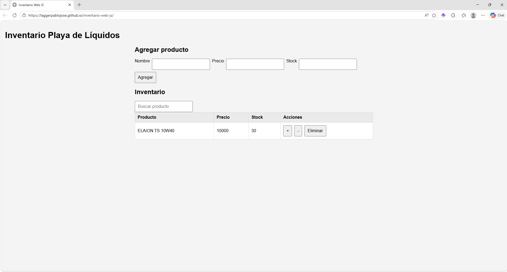
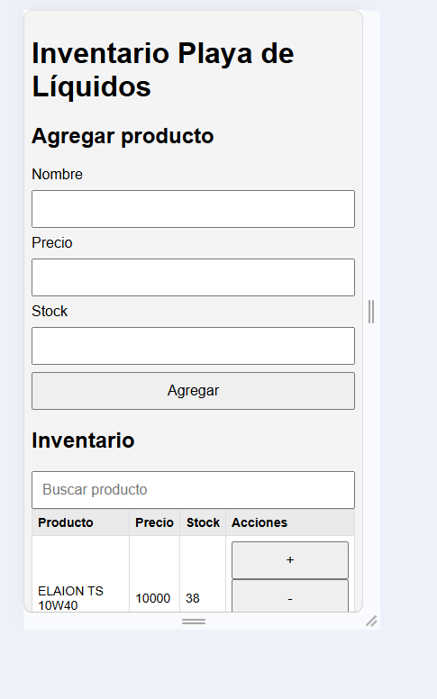

# Inventario Web JS

## Objetivo

Desarrollar una aplicación web simple de gestión de inventario para la playa de líquido de una estación de servicio, implementando un CRUD de productos con persistencia en LocalStorage usando HTML, CSS y JavaScript vanilla.

El sistema busca resolver el control básico de existencias en tiempo real para productos como lubricantes y artículos de limpieza vehicular.

---

## Alcance (MVP)

Este proyecto cubre:

- Alta de productos
- Consulta de inventario
- Actualización de stock
- Eliminación de productos
- Persistencia local en navegador mediante LocalStorage

Cada producto se gestiona con:

```js
{
  (id, nombre, precio, stock);
}
```

---

## Funcionalidades actuales

### Gestión de productos

- Registro producto
- Definir precio
- Cargar stock inicial
- Editar stock (+ / -)
- Eliminar productos del catálogo

### Inventario

- Visualizar productos en tabla
- Mostrar existencias actuales
- Identificar stock bajo
- Actualización inmediata del inventario.

---

## Reglas del modelo

Nota importante:

- El stock **stock final no es un campo almacenado**, sino un valor dinámico calculado según movimientos.
- El inventario se basa en:

```text
Stock actual = Stock inicial + entradas - salidas
```

---

## Stack tecnológico

Tecnologías utilizadas:

- HTML5
- CSS3
- JavaScript (Vanilla)
- LocalStorage
- GitHub Pages

Sin frameworks ni backend.

---

## Esctructura del proyecto

```text
inventario-web-js/
│
├── index.html
├── README.md
│
├── src/
│   └── app.js
│
└── styles/
    └── styles.css
```

---

## Arquitectura inicial

La lógica se organiza en funciones separadas:

Persistencia:

- leerDeLS()
- guardarEnLS()

Interfaz:

- renderProducto()

Lógica de negocio:

- agregarProducto()
- actualizarStock()
- eliminarProducto()

Estado:

```js
let productos = [];
```

---

## Estado

Proyecto en desarrollo

MVP funcional implementado:

- CRUD básico de productos
- Persistencia en loclaStorage
- Gestión de stock en tiempo real
- Alertas visuales de stock
- Búsqueda simple
- Diseño responsive básico

Próximas mejoras:

- Edición de precio
- Validaciones más robustas
- Historial de movimientos
- Exportación de datos

## Demo

[Ver demo online](https://laggerpablojose.github.io/inventario-web-js/)

## Screenshots

### Vista escritorio



### Vista mobile



## Cómo ejecutar localmente

Clonar repositorio:

```bash
git clone https://github.com/tuusuario/inventario-web-js.git
```

Abrir:

```bash
index.html
```

en cualquier navegador.

No requiere instalación.
